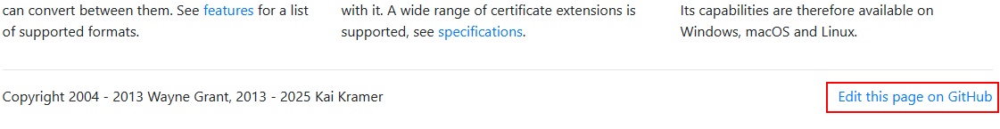

# Source of the KeyStore Explorer website

Here is the Source code of the KeyStore Explorer website: https://keystore-explorer.org.

---

## Contributing to the Documentation or Website

Good documentation is crucial for any kind of software. You can help improving the documentation:
* Please report missing, incorrect, or out-dated documentation as an
[issue](https://github.com/kaikramer/keystore-explorer/issues).
* The [KSE website](https://keystore-explorer.org) is in a [GitHub
repository](https://github.com/kaikramer/kaikramer.github.io) just like the KSE
source code, which means improvements for the website can be contributed in the
same way as code contributions. Or you could open an
[issue](https://github.com/kaikramer/keystore-explorer/issues) if you think the
website could be improved, but don't want to do it yourself.

Every page of this website has a "Edit this page" link at the bottom. This will take you to the
GitHub repository where you can propose changes to the page:




## Building and Running the Website Locally

This website is built using the static site generator [Astro](https://astro.build/).

To build and run the website locally, you need to have [Node.js](https://nodejs.org/) installed.

To build and run the website locally, execute these commands in the root directory of the repository:

```bash
# Install the required dependencies
npm install

# Run the website locally with live-reload
npm run dev
```
This will start a local dev server, by default at
[http://localhost:4321](http://localhost:4321).

To produce a production build (output written to `dist/`):

```bash
npm run build
```

The site is deployed automatically to GitHub Pages via the workflow in
[.github/workflows/deploy.yml](.github/workflows/deploy.yml) whenever changes are pushed to `main`.

---
See also: [main page about Contributing to the KeyStore Explorer Project](https://github.com/kaikramer/keystore-explorer/blob/main/CONTRIBUTING.md)
